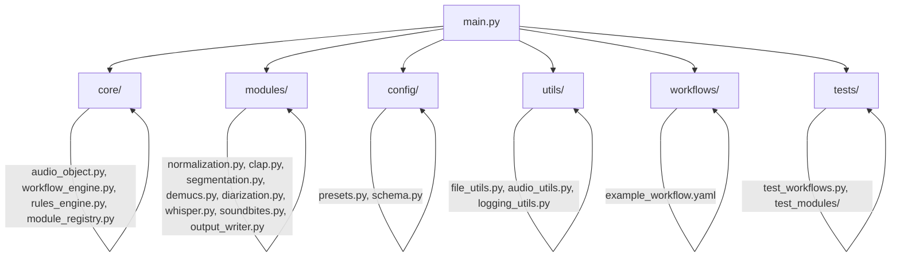
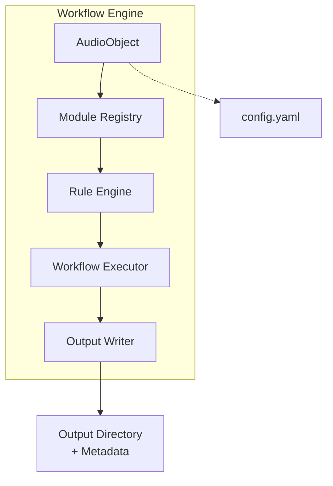
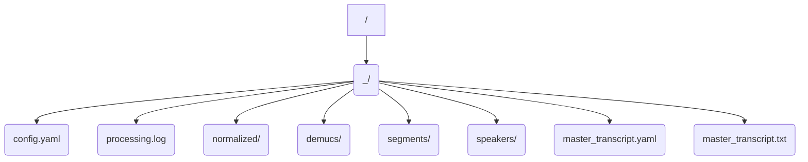

# System Patterns: Modular, Rule-Driven Architecture (2025)

## Architecture Overview

- **Modular Directory Structure:** Each processing step is a separate file in `modules/`, with a clear interface (input/output/settings).
- **Core Logic:** Audio object, workflow engine, rules engine, and module registry are in `core/`.
- **Config and Schema:** Centralized in `config/`.
- **All I/O and Utility Code:** In `utils/`.
- **Tests:** In `tests/`, with a focus on regression prevention and module independence.

## Modular Directory Structure



## Path Forward
- Scaffold the new modular directory and file structure.
- Migrate each feature/module from the monolith to its own file, with clear interfaces and tests.
- Implement and validate the CLAP-driven segmentation workflow as the baseline.
- Expand to more workflows and modules as needed.
- Plan for LLM-driven orchestration as a future enhancement.

## CLAP-Driven Segmentation Workflow (Baseline)

```mermaid
flowchart TD
    Input[Input Audio] --> Normalize[Normalization]
    Normalize --> CLAP[CLAP Annotation]
    CLAP --> SegLogic[Segmentation Logic<br>(Speech/Ringing to Hang-up)]
    SegLogic --> Segments[Audio Segments]
    Segments --> Whisper[Whisper Transcription]
    Whisper --> Output[Output Writer]
```

- **CLAP** detects speech, telephone ringing, and hang-up tones.
- **Segmentation logic** splits audio at these points.
- **Each segment** is transcribed by Whisper.
- This is the **standard workflow to implement and validate first**.

## System Component Relationships



## Output Directory Structure



## Key Patterns
- Pipeline pattern (modular chaining)
- Strategy pattern (user-config

### Modular, User-Driven Workflow Architecture (Planned)
- All processing steps (input, normalization, Demucs, Pyannote diarization, Whisper transcription, CLAP, soundbite extraction, etc.) are modular and can be chained in any order via a user-driven workflow editor in the UI.
- The backend dynamically constructs and executes the pipeline based on the user's workflow definition (from the UI or YAML).
- All legacy features are preserved as modular steps, ensuring no loss of functionality.
- Users can define rules, branching, and event-driven logic for advanced workflows.
- The system is designed for extensibility: new steps, detectors, or output types can be added without breaking existing workflows.

### Dynamic Pipeline Example
- User selects input(s), configures steps and parameters, and saves the workflow.
- The pipeline is built and executed dynamically, with all outputs, metadata, and lineage tracked and logged.

### Error Handling and Validation
- Each step is validated before execution.
- Regression testing ensures all legacy workflows can be recreated and run in the new system.

## Key Patterns
- **Pipeline Pattern:** Modular, user-defined step chaining.
- **Strategy Pattern:** User selects/configures strategies for each step (e.g., model, thresholds).
- **Rule/Branching Pattern:** Users can define event-driven or conditional logic in workflows.
- **Extensibility:** New steps and features can be added as modules.

### Core Components
1. **Audio Processing Pipeline (Pyannote-First Workflow - Implemented)**
   ```mermaid
   flowchart TD
       Input[Input File/URL/Folder] --> ProcessCheck{Input Type?}
       ProcessCheck -- File/URL --> PreProcess
       ProcessCheck -- Folder --> FindNewest[Find Newest Compatible]
       FindNewest --> PreProcess
       
       subgraph PreProcess
            direction LR
            PreProcess --> VidCheck{Video?}
            VidCheck -- Yes --> Extract[ffmpeg: Extract Audio]
            VidCheck -- No ----> UseOriginal[Use Original Audio]
            Extract --> NormalizedInput
            UseOriginal --> NormalizedInput
            NormalizedInput --> Normalize[ffmpeg: Normalize Audio (-16 LUFS)]
       end

       Normalize --> OriginalNormAudio[Original Normalized Audio]

       subgraph Optional Separation
           direction LR
           OriginalNormAudio --> OptDemucs{Demucs Enabled?}
           OptDemucs -- Yes --> Demucs[Demucs: Separate Vocals]
           Demucs --> Vocals[Vocals Track]
           Demucs --> NoVocals[Non-Vocals Track]
           OptDemucs -- No ----> SkipDemucs[Use Normalized Audio Directly]
       end

       Vocals --> AudioForDiarization{Audio for Diarization}
       SkipDemucs --> AudioForDiarization

       AudioForDiarization --> Diarize[Pyannote 3.1: Diarize Speakers]
       Diarize --> DiarizationResult[Diarization Timeline]
       DiarizationResult --> MergeTurns[Merge Adjacent Turns (Same Speaker)]
       MergeTurns --> MergedBlocks[Merged Speaker Blocks]

       subgraph Optional Contextual Annotation
          direction LR
          OriginalNormAudio --> OptClap{Contextual CLAP Enabled?}
          OptClap -- Yes --> ClapEvents[CLAP: Detect Events on Full Audio]
          ClapEvents --> EventData[Contextual Event Data]
          OptClap -- No ----> SkipClap
       end

       MergedBlocks --> LoopBlocks{Loop Merged Blocks}

       subgraph Process Speaker Blocks
           direction LR
           LoopBlocks --> ExtractSegment[soundfile: Extract Original Norm. Segment]
           ExtractSegment --> SegmentAudio[Segment Audio Data]
           SegmentAudio --> Transcribe[Whisper: Transcribe Segment]
           Transcribe --> SegmentResult[Segment Result (Text, Speaker, Timestamps)]
       end

       SegmentResult --> AggregateResults[Aggregate Results]
       EventData --> AggregateResults

       AggregateResults --> BuildYAML[Build Final Dictionary]
       BuildYAML --> FinalOutput[YAML Dump (master_transcript.yaml w/ CustomDumper)]
   ```

2. **File Structure (As Implemented)**
   - Each run generates a unique root directory: `<output_folder>/<input_filename>_<timestamp>/`
   - Subdirectories within the run folder organize outputs by processing step.
   ```mermaid
   graph TD
       Input(Input File/Folder/URL) --> MainOutput{Output Folder}
       MainOutput --> RunDir("<input_name>_<timestamp>")

       subgraph Run Directory
           RunDir --> Config(config.yaml)
           RunDir --> Log(processing.log)
           RunDir --> NormDir(normalized/)
           RunDir --> DemucsDir(demucs/)
           RunDir --> DiarizationDir(diarization/)
           RunDir --> EventsDir(events/)
           # Removed SoundsDir as contextual sound detection isn't implemented yet
           # RunDir --> SoundsDir(sounds/)
           RunDir --> SegmentsDir(segments/)
           RunDir --> MasterYAML(master_transcript.yaml)
           # Removed specific transcript files as main output is YAML
           # RunDir --> TranscriptsDir(transcripts/)
           # RunDir --> ResultsZip(results.zip) # Zip is optional
       end

       NormDir --> NormWav("*.wav")
       DemucsDir --> VocalsWav("*_vocals.wav")
       DemucsDir --> NoVocalsWav("*_no_vocals.wav")
       DiarizationDir --> DiarizationRTTM("diarization.rttm")
       EventsDir --> EventsJSON("contextual_events.json")
       # SoundsDir --> SoundsJSON("sounds.json")
       SegmentsDir --> SegmentWav("block_*.wav")
       # TranscriptsDir --> FullTxt("full_transcript.txt")
       # TranscriptsDir --> SegmentTxt("segment_*.txt")

       style DemucsDir fill:#f9f,stroke:#333,stroke-width:2px
       style EventsDir fill:#f9f,stroke:#333,stroke-width:2px
       # style SoundsDir fill:#f9f,stroke:#333,stroke-width:2px, BORDER-STYLE: dashed
       style SegmentsDir fill:#ccf,stroke:#333,stroke-width:2px # Segments are always created now
       # note right of DemucsDir : Dashed boxes indicate optional outputs dependent on configuration
       note right of DemucsDir : Pink boxes indicate optional outputs dependent on configuration
       note right of SegmentsDir : Blue box indicates standard intermediate output of Pyannote-first workflow
   ```
   **Subdirectory Purpose:**
   *   `normalized/`: Normalized audio derived from input.
   *   `demucs/`: Optional: Output from vocal separation (vocals, no_vocals).
   *   `diarization/`: Output from speaker diarization (RTTM format).
   *   `events/`: Optional: Detected event data from contextual CLAP run on full audio.
   *   `segments/`: Audio segments extracted based on merged diarization blocks, used for transcription.
   *   `master_transcript.yaml`: **Primary Output:** Structured YAML output containing all metadata, conversation blocks (speaker, timestamps, text, word timings if enabled), and optional contextual events.
   *   `config.yaml`: Copy of the preset configuration used for the run.
   *   `processing.log`: Log file for the run.

## Design Patterns

### 1. Pipeline Pattern
- **Pyannote-first processing:** Diarization drives segmentation.
- Sequential steps: Normalize -> [Demucs] -> Diarize -> Merge -> [CLAP] -> Extract/Transcribe Loop -> Aggregate.
- Coordinated segment handling via merged blocks.

### 2. Strategy Pattern
- Configurable behavior via `presets.py`:
    - Optional Demucs (`workflow['separate_vocals']`).
    - Optional Contextual CLAP (`workflow['detect_events_contextual']`).
    - Whisper model size (`transcription['model_size']`).
    - Word timestamps (`transcription['word_timestamps']`).
    - Diarization/Merging parameters (`diarization['merge_gap_s']`, `diarization['min_block_duration_s']`).

### 3. Helper Functions / Utility Pattern
- Dedicated functions for specific tasks:
    - `normalize_audio`
    - `separate_vocals_with_demucs`
    - `merge_diarization_turns`
    - `extract_audio_segment`
    - `run_clap_event_detection`
    - `format_speaker_label`

## Key Technical Decisions

### 1. Segmentation Strategy
- **Pyannote Speaker Diarization (3.1):** Primary method for identifying speaker turns.
- **Turn Merging Logic (`merge_diarization_turns`):** Merging adjacent turns *from the same speaker* based on `max_silence_gap` to form coherent speaker blocks.
- **Segment Extraction (`extract_audio_segment`):** Using merged block boundaries to extract corresponding audio segments from the *original normalized* audio using `soundfile` for transcription.
- **CLAP-based segmentation DEPRECATED. CLAP is used for annotation/context only, not for segmentation or cutting.**
- **Type safety:** All pipeline utility functions must return type-consistent, schema-validated outputs (e.g., dicts with 'start'/'end' keys). Downstream steps must robustly check input types and log errors if mismatches are detected.
- **Regression testing:** Output format and structure must be validated after every change to prevent silent breakage of downstream steps.

### 2. Audio Track Management
- **Original Normalized Audio:** Preserved and used as the source for segment extraction.
- **Optional Vocals Track:** Used as input for diarization if Demucs is enabled.
- **Optional Non-Vocal Track:** Saved but not actively used in the main transcription flow (potentially input for contextual CLAP).

### 3. Processing Flow
- **Speaker Block Centric:** The main processing loop iterates through the merged speaker blocks derived from diarization.
- **Transcription per Block:** Whisper is run individually on each extracted audio segment.
- **Contextual Annotation:** Optional CLAP runs on the full normalized audio and results are correlated with the final blocks.

### 4. Output Structure
- **Primary Output:** `master_transcript.yaml` containing structured data.
- **Intermediate Files:** Organized into subdirectories (`normalized`, `demucs`, `diarization`, `segments`, `events`).

## Component Relationships

### 1. Diarization & Merging
- **Input:** Normalized audio (or Vocals track if Demucs used).
- **Process:** Runs Pyannote 3.1 pipeline, applies `merge_diarization_turns` based on `max_silence_gap` and `min_block_duration`.
- **Output:** List of merged speaker blocks (dictionaries containing speaker, start, end, duration, original turns).

### 2. Segment Processing & Transcription
- **Input:** Merged speaker blocks, Original Normalized Audio path.
- **Process:** Loops through blocks:
    - Calls `extract_audio_segment` using block timestamps on the original normalized audio.
    - Runs Whisper transcription on the extracted segment WAV file.
    - Optionally correlates with pre-computed contextual CLAP events based on timestamp overlap.
- **Output:** List of dictionaries, each representing a processed block with transcription, speaker, timings, etc.

### 3. Output Generation
- **Input:** Aggregated results dictionary containing metadata, processed blocks, paths, etc.
- **Process:** Uses `yaml.dump` with a `CustomDumper` to serialize the results dictionary (handling numpy/Segment objects) into `master_transcript.yaml`.

## Error Handling
- **Try/Except Blocks:** Used around major processing steps (Normalization, Demucs, Diarization, CLAP, Transcription loop, YAML saving).
- **Status Updates:** `